> + github地址：[mswnb/MFC-Draw (github.com)](https://github.com/mswnb/MFC-Draw)
> + github国内镜像地址：https://kgithub.com/mswnb/MFC-Draw
> + gitee地址：可惜没有，嫌麻烦不想弄了😂

# MFC-DRAW

基于MFC的简易绘图程序，支持绘制各种图形及文本、修改已有图形、撤回、保存等。附有详细的功能实现过程。

## 基本功能

1. 拥有含标题条、菜单、工具条、和绘图工作区的窗口界面。
2. 支持修改画笔的粗细和颜色。
3. 支持绘制各种基本图形，包含直线、矩形、正方形、圆、椭圆、三角形、五边形、六边形。
4. 支持多种画笔模式，包含铅笔、橡皮、填充、文本框。
5. 支持框选部分区域并可对选中区域进行拖动、**放大缩小**、删除操作。
6. 支持撤回操作。
7. 支持保存当前图像文件和打开已有图像文件（bmp格式）。

## 项目创建

### 第一步：创建项目

该绘图程序开发及运行环境为 **Microsoft Visual Studio 2022**。打开Visual Studio，选择创建新项目，选择创建 **MFC应用**。将项目命名为自己学号，选择MFC的应用程序类型为 **单文档**，项目样式选择为 **MFC standard**，点击完成，即可等待系统自动建立新项目。


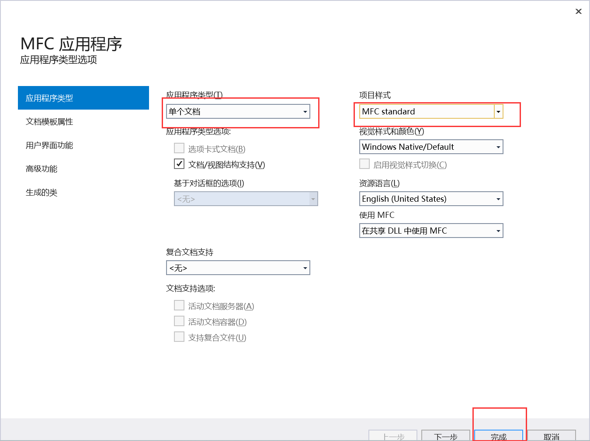

项目创建完成后，其中已自动包含了一些文件。其类结构大致如下:

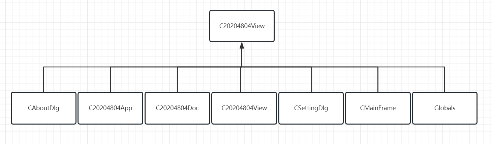

这里只需关心其中两个类。第一， `CSettingDlg`用来编辑类的消息响应函数，例如当我们创建一个新的对话框时，就需要用到该类的相关函数。第二， `C20204804View`代表了程序运行的可视化窗口，它包含工具栏和菜单栏的命令响应函数以及鼠标的消息响应函数。实现绘图过程中各个功能的代码都将在这个类中进行编写。
根据上面列出的基本功能，应事先在 `C20204804View`类（后缀为h的文件）中添加如下成员：

- 该程序允许用户调整画笔的粗细，因此增加一个代表画笔粗细的变量 `int Pen_Size`。
- 用户可以调整画笔的颜色以及使用填充功能，因此增加画笔颜色和填充颜色 `COLORREF Pen_Color, Brush_Color`。
- 图像需要随着用户的鼠标移动实时展现在工作区，因此需要有记录用户鼠标位置的变量 `CPoint BeginPoint, EndPoint`。它们分别代表用户按下鼠标的点和抬起鼠标的点。
- 用户需要用特定的模式完成对特定图形的绘制，而且这些模式都互不兼容（即不能同时在两种模式下进行绘画），因此创建了一个枚举类型。
- 程序允许撤回操作，用一个列表 `list<HBITMAP> SaveSeries`暂存用户工作区先前的图像。与此同时设置 `int savenum`代表用户可撤回的最大步数（这里先暂时注释掉，等后续开发到撤回功能后再解开注释，并完善撤回功能）。
- 为实现插入文本框功能，为文本框指定一个编号 `int Textid`、文本框指针 `CEdit* m_Edit`以及文本框位置 `CPoint Text_Pos`。

代码如下：

```c++
int Pen_Size;//画笔粗细
COLORREF Pen_Color, Brush_Color;//画笔颜色，填充颜色
CPoint BeginPoint, EndPoint, //图形起始点，图形终止点
    Chooselt, Choosebr, Tempclt, Tempcbr, Startlt, Startbr;//选框左上角，选框右下角

enum class Shape {//形状
        Line, Rectangle, Square, Circle, Ellipse,//直线，矩形，正方形，圆，椭圆，
        Triangle, Pentagon, Hexagon,//三角形，五边形，六边形
        Pencil, Fill, Text, Eraser, Choose, LImage//画笔，填充, 文本，橡皮，选择，加载图片
}m_Shape;

//list<HBITMAP> SaveSeries;//暂存图片列表

int Textid = 100;
int savenum = 0;//撤回计数
bool Chosen = false;//是否已经选择了一个区域
HDC bc_hdc, ac_hdc;//选中前画面，选中后画面
CEdit* m_Edit = nullptr;
CPoint Text_Pos = CPoint(0, 0);//文本框位置
```

以上是事先需要在`C20204804View`类（后缀为h的文件）中添加的成员变量，它们的作用将在后面的分析中详细介绍。

> **注意！：**
>
> 后缀h的文件为代码头文件，主要编写变量及函数的定义；后缀为cpp的为源文件，主要编写函数的实现；
> 后续步骤中我将不再解释其含义了，都以xxx类头文件和xxx类源文件称呼！

## 具体功能分析和实现

### 第一步：添加菜单选项

在该工程的**资源视图**下找到 **Menu** 文件夹，双击Menu文件夹中的**IDR_MAINFRAME**选项就可以打开菜单界面，并添加所需的选项。


根据上述提到的基本功能，在 **文件** 一栏保留新建、打开、保存三个选项， **编辑** 一栏仅保留撤销选项。画图所用的工具和选项均在 **绘图** 一栏，图形包含**直线、矩形、多边形（其中含三角形、五边形、六边形）、圆、椭圆，工具包含铅笔、填充、文本框、橡皮、选择区域**。关于**画笔工具**的设置单独新建一栏，其中包含**粗细**和**颜色**。菜单栏设置完毕，接下来只需要再为每一个选项编写事件处理程序，就能在点击这些选项时实现对应的功能。

### 第二步：画笔粗细和颜色的实现

#### 画笔粗细功能实现

实现调整画笔粗细功能的思路如下：点击菜单中的画笔设置-粗细，弹出一个对话框，用户输入粗细的数值，点击确认即可更改画笔粗细。因此我们需要一个能够处理用户输入的对话框程序。在资源视图中的 **Dialog** 文件夹添加一个类型为 `Dialog`（对话框）的资源；在该工程的**资源视图**下找到 **Dialog** 文件夹右键选择**添加资源**，如下所示：

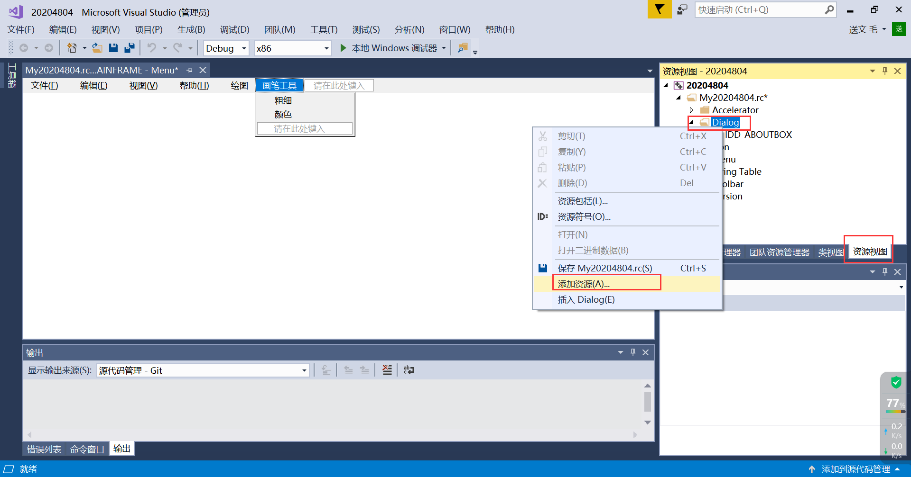

弹出**添加资源**窗口后，选择**Dialog**后新建一个对话框，如下所示：

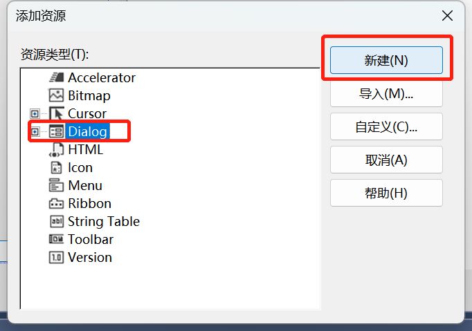

添加资源后，在左侧工具箱中，将一个 `Edit Control`（输入文本）和 `Static Text`（文字说明）控件添加进对话框，更改 `Static Text`的内容，设置粗细的对话框便设置完毕。

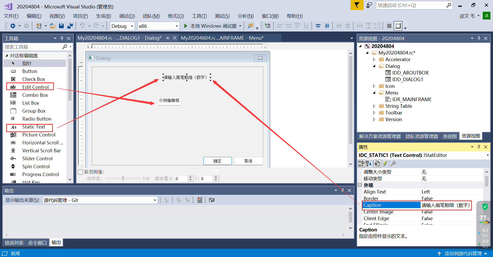

为了调用这个对话框，需要为该对话框添加一个类，右键刚刚新建的**Dialog**对话框选择**添加类**

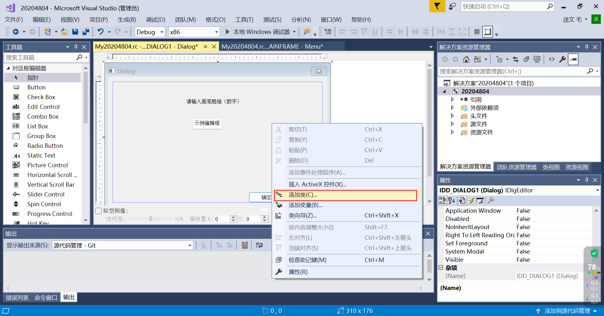

然后给该类设置**类名**后，点击**确定**按钮：

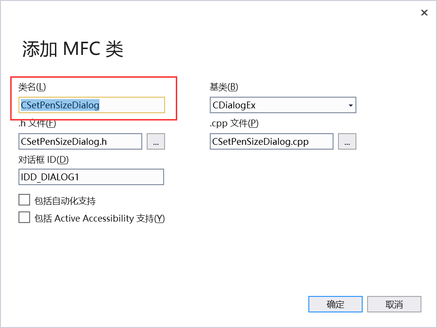

接下来要为输入文本框添加以下变量，还是右键刚刚新建的**Dialog**对话框选择**添加变量**：

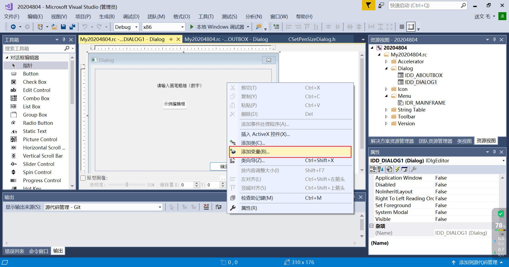

为输入文本框控件设置名称，下拉选择**控件ID**为**IDC_EDIT1**的控件，并设置**名称**后点击**完成**

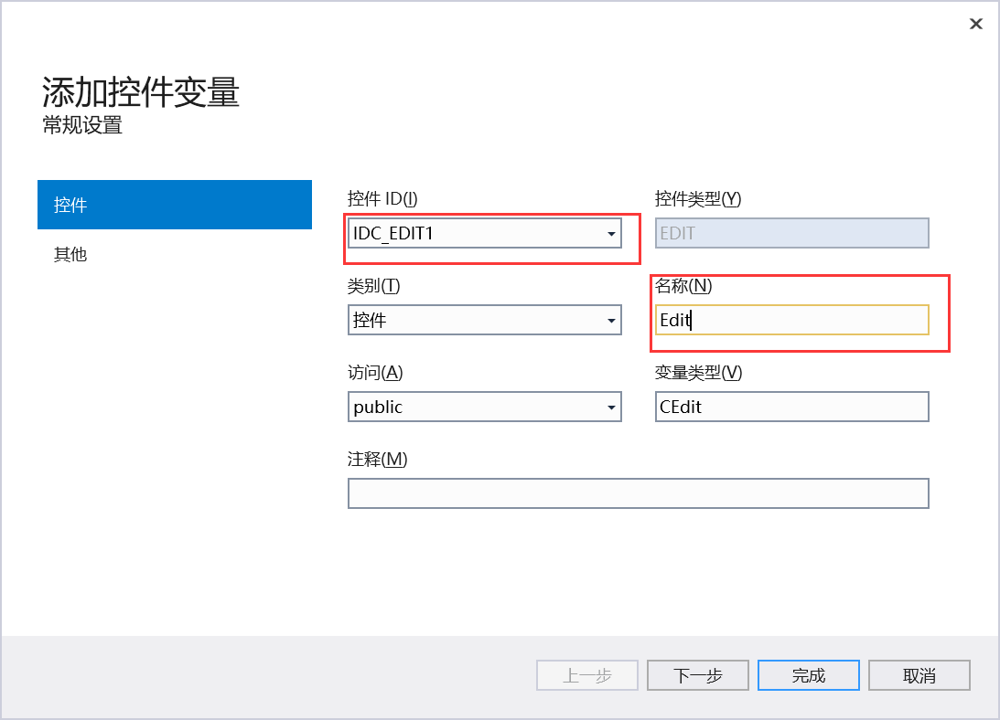

##### 设置画笔粗细代码实现

在 `CSetPenSizeDialog`类头文件中添加成员 `int Pen_Size = 1`:

```c++
int Pen_Size = 1;//初始画笔粗细为1
```

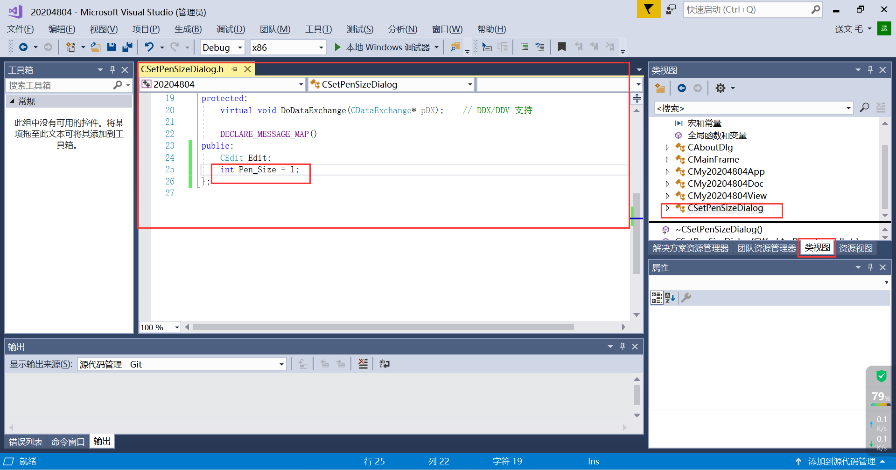

然后在 `CSetPenSizeDialog`类源文件中的 `CSetPenSizeDialog::DoDataExchange`函数中添加如下代码，即可将输入的数值转变为画笔粗细：

```c++
CString str;
Edit.GetWindowTextW(str);//获取用户输入的画笔粗细
Pen_Size = _ttoi(str);//将用户输入的画笔粗细度进行设置
```

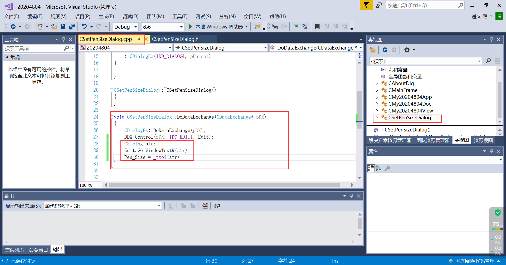

接下来为菜单栏的 **粗细** 添加事件处理程序，我们应该回到**资源视图**下，找到我们之前的**Menu**选项中的**IDR_MAINFRAME**并双击打开，在**画笔工具**中的**粗细**选项栏中右击给它**添加处理点击事件**


接下来为该**粗细**点击事件**添加函数绑定**，设置**函数名**（尽量不要和我雷同！），**切记类列表**下拉选择自己的`CMy20204804View`类，填写好后点击确定即可，等待VS_Studio自动为我们创建好函数

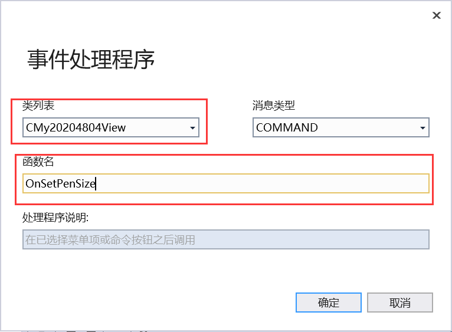

最后给`OnSetPenSize`函数添加以下代码，即可在点击该选项后调用上面的对话框：

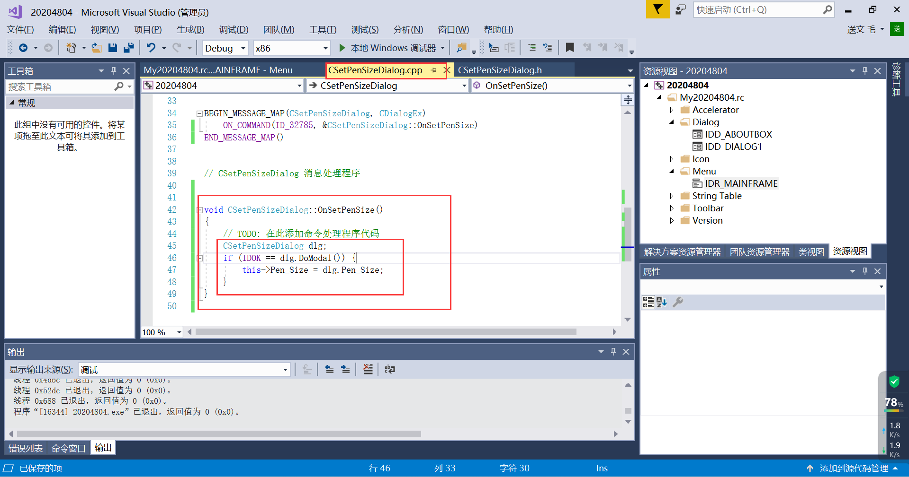

```c++
//颜色选择功能点击事件
void CMy20204804View::OnSetPenSize()
{
	// TODO: 在此添加命令处理程序代码
	CSetPenSizeDialog dlg;
	if (IDOK == dlg.DoModal()) {
		this->Pen_Size = dlg.Pen_Size;
	}
}
```

上面的语句将 `CMy20204804View`类中的 `Pen_Size`设置为用户在对话框中输入的 `Pen_Size`，这样设置画笔粗细功能就实现了。

> **注意：**
>
> 在上方的代码中遇到`CSetPenSizeDialog`引用报错是由于在`CMy20204804View`类源文件中没有导入`CSetPenSizeDialog`所需要的依赖，我们可在`CMy20204804View`类源文件最上方添加`CSetPenSizeDialog`所需要的依赖即可
>
> 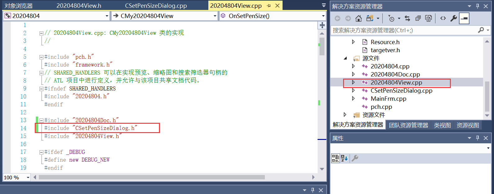

#### 颜色设置功能实现

更改画笔颜色功能，只需调用项目自带的 `CColorDialog`类的对话框。为 **颜色** 选项**添加事件处理程序**，我们还是回到**资源视图**的**Menu**文件夹的**IDR_MAINFRAME**项并双击打开它，在**画笔工具**中**颜色**选项栏中右击给它**添加处理点击事件**。

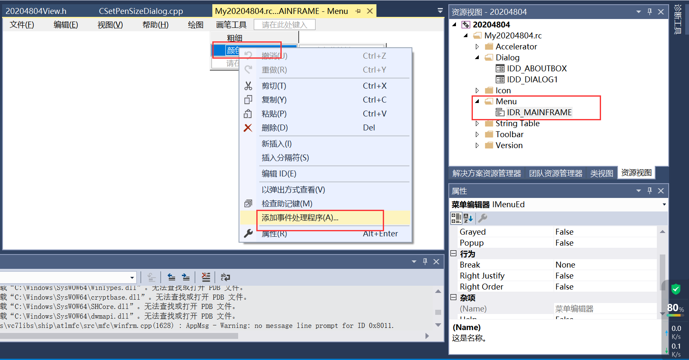

接下来的步骤也和之前给**粗细**功能的点击事件**添加函数绑定**苟同，设置**函数名**（还是尽量不要和我雷同！），还是**切记类列表**下拉选择自己的`CMy20204804View`类，填写好后点击确定即可，接着又等待VS_Studio自动为我们创建好函数

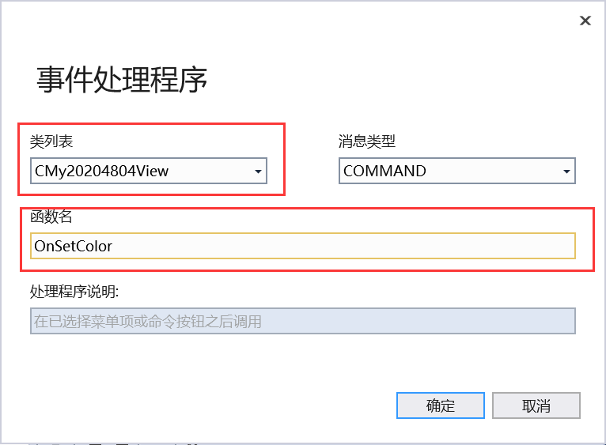

最后给`OnSetPenSize`函数添加如下代码，即可调用该对话框：

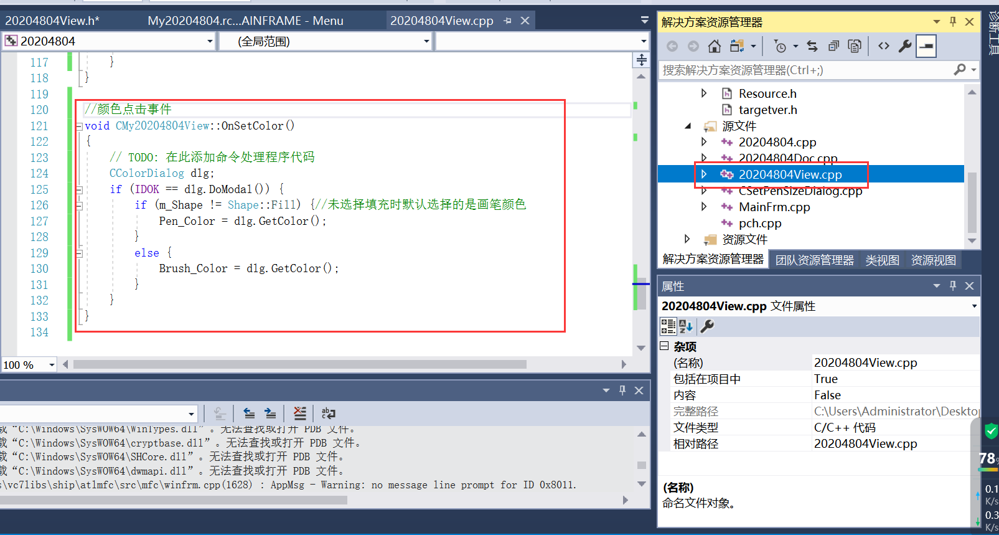

```c++
//颜色选择功能点击事件
void CMy20204804View::OnSetColor()
{
	// TODO: 在此添加命令处理程序代码
	CColorDialog dlg;
	if (IDOK == dlg.DoModal()) {
		if (m_Shape != Shape::Fill) {//未选择填充时默认选择的是画笔颜色
			Pen_Color = dlg.GetColor();
		}
		else {
			Brush_Color = dlg.GetColor();
		}
	}
}
```

> **引言：**
>
> 以上就是对**画笔工具**栏中的**粗细**和**颜色**调整功能的所有实现了，不妨运行一下自己的程序，看看都是否出现了以下图片所示的功能展示了，如果出现了则恭喜你，完成了以上的功能实现了，如果没有出现图中的东西或者在程序运行过程中碰到报错，那么你一定漏看或者忽略我之前的步骤，那么就请你回顾之前的操作步骤。这里需要提醒一下VS_Studio编辑工具中每当你修改某个类文件时，label栏就出现带有*号文件则表示你该文件有过修改并未保存，出现这个的时候需要你手动Ctrl+s保存代码的！
>
> 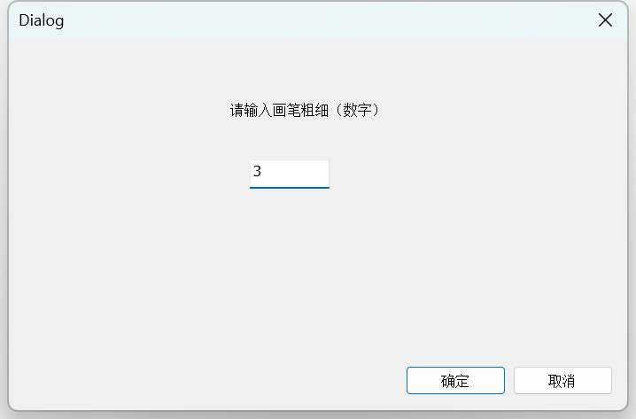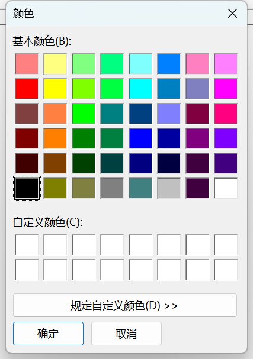
>
> 


### 第三步：图形的编写

我们需要在程序启动时默认为直线构造以及粗细颜色等，在`C20204804View`类源文件中找到构造函数，添加如下代码：

```c++
Pen_Size = 1;//画笔粗细
Pen_Color = RGB(0, 0, 0);//画笔颜色
Brush_Color = RGB(0, 0, 0);//填充颜色
BeginPoint = CPoint(0, 0);//图形起始点
EndPoint = CPoint(0, 0);//图形终止点
m_Shape = Shape::Line;//默认画线段
```


#### 直线的编写实现

首先为 **直线** 选项**添加事件处理程序**，当我们点击该选项时，将 `CMy20204804View`类中的 `m_Shape`成员更改为 `Shape::Line`，这样当我们在工作区绘画时，只有判断 `m_Shape`为 `Shape::Line`时才会执行画直线的操作。这里就不再演示给某个功能**添加事件**了，之后也不会演示了，因为步骤和上述给**粗细**和**颜色**功能添加点击事件一样，实在不明白可参考上述步骤，以下是代码实现：

```c++
//直线
void CMy20204804View::OnDrawLine()
{
	// TODO: 在此添加命令处理程序代码
	m_Shape = Shape::Line;
}
```

 为实现在工作区绘画，需要添加鼠标消息函数。在类向导中添加相应的鼠标消息处理程序如下：

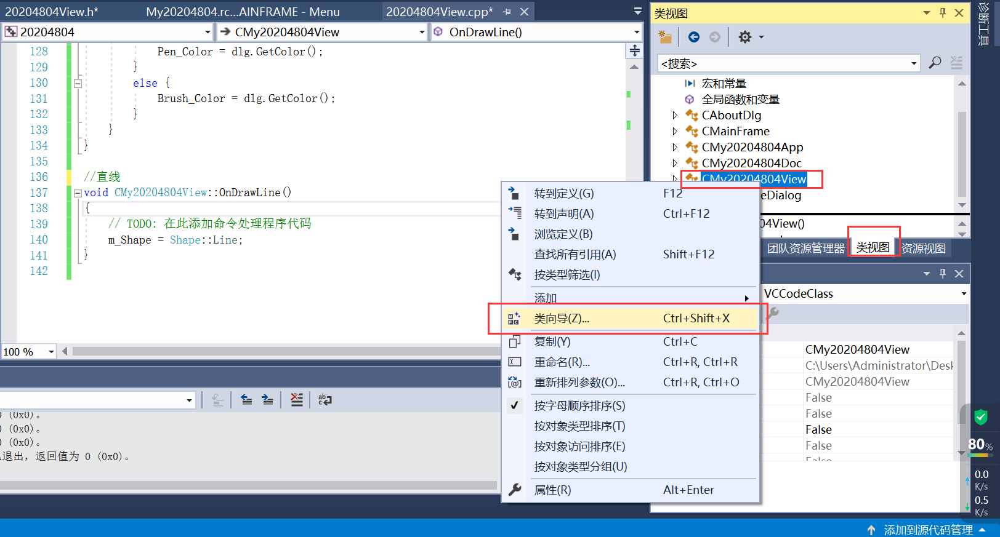

`OnMouseMove`为鼠标移动时会执行的操作， `OnLButtonDown`为鼠标左键按下时会执行的操作， `OnLButtonUp`为鼠标左键抬起时会执行的操作， `OnRButtonDown`、 `OnRButtonUp`则为右键按下和抬起时会执行的操作。以上是绘画前的准备工作。

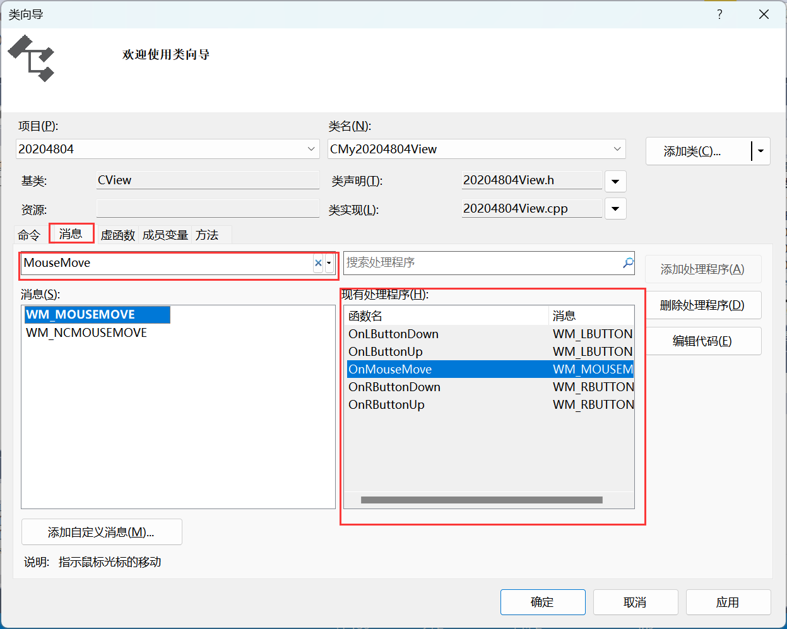


当我们按下鼠标左键时，将 `BeginPoint`和 `EndPoint`初始化为当前鼠标位置。根据习惯，当我们按住左键在工作区中拖动时，就会在工作区中显示相应的图形，所以我们需要在`OnLButtonDown`函数中添加以下代码为鼠标左键按下时会执行的操作：

```c++
void CMy20204804View::OnLButtonDown(UINT nFlags, CPoint point)
{
	// TODO: 在此添加消息处理程序代码和/或调用默认值
	BeginPoint = EndPoint = point;
	Text_Pos = point;
	CView::OnLButtonDown(nFlags, point);
}
```


当我们抬起左键，一个图形就完成了。因此在 `OnMouseMove`函数中设置判断条件，只有在 `nFlags & MK_LBUTTON`（鼠标移动且左键被按下）的情况下才会进行绘画。我们需要先创建一个句柄 `CClientDC dc(this)`，由它帮助我们实现绘画的动作。接下来再为它选择合适的画笔，代码如下（**以下代码均在`OnMouseMove`函数中，并每个图形都对应着switch语句中的一个case,后续的图形功能只需往switch语句加case即可**）：

```c++
if (nFlags & MK_LBUTTON) {
    CClientDC dc(this);
    CPen newPen, choosePen, *oldPen;
    newPen.CreatePen(PS_SOLID, Pen_Size, Pen_Color);
    oldPen = dc.SelectObject(&newPen);
    switch (m_Shape) {
        case Shape::Line:
            dc.SetROP2(R2_NOTXORPEN);//画笔颜色与屏幕像素值的异或再反色，达到画笔移动的效果
            dc.MoveTo(BeginPoint);
            dc.LineTo(EndPoint);
            
            dc.MoveTo(BeginPoint);
            dc.LineTo(point);
            EndPoint = point;
            break;
        default:
            break;
    }
	dc.SelectObject(oldPen);
}
```

定义的画笔为实线，粗细和颜色为当前设定的。这里之所以需要 `oldPen`，是为了防止内存泄露。然后判断当前的模式 `m_Shape`，这里使用 `switch`语句（因为后面还有很多其他图形），当 `m_Shape`为 `Shape:: Line`时开始画直线。然后使用dc自带的 `MoveTo`和 `LineTo`函数，它代表从 `MoveTo`的点到 `LineTo`的点画一条直线。
但是仅仅将这两个函数调用一遍还不够，因为只要我们移动鼠标，程序就会不断执行这个函数，从而会看到屏幕随着鼠标的移动显示出“无数”直线，这与实际不符。为了实现实际画图中的“橡皮筋”效果，我们必须设置画笔模式为 `R2_NOTXORPEN`，它的意思是将画笔颜色与屏幕像素值取异或再取反。即，在鼠标移动时，先将上次画出的直线擦除，再画出新的直线，这样就达到了直线随着我们的鼠标移动的效果。

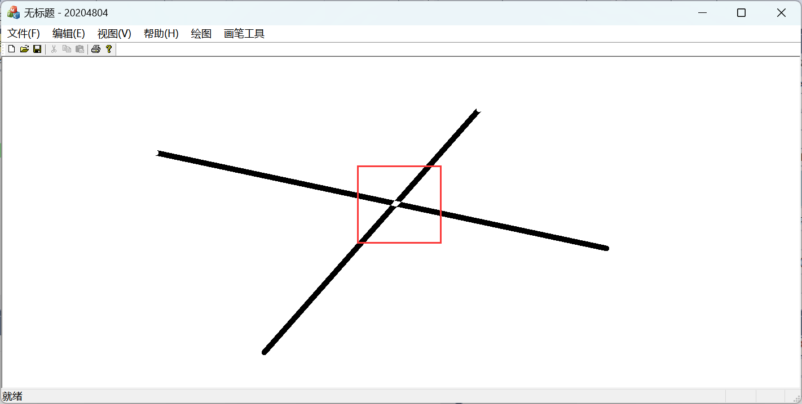

前3条语句将上一步画出的线擦除，后2条语句画出新的直线。`point`为我们当前鼠标位置。每次绘画完毕，用 `EndPoint`储存当前鼠标的位置，以便下次擦除上次的绘画痕迹。
实际测试时还会发现如下问题，当有多条直线相交时，相交部分会变为白色。这是我们画笔模式选择了 `R2_NOTXORPEN`的缘故。因此当我们抬起鼠标时，应当将这片白色的部分重新补回正常的颜色。所以我们还要在 `OnLButtonUp`中添加如下代码，重新绘画一遍相交部分(**之后在其它图形编写过程遇到调整都会在此事件中添加对应图形的case**)：

```c++
void CMy20204804View::OnLButtonUp(UINT nFlags, CPoint point)
{
	// TODO: 在此添加消息处理程序代码和/或调用默认值
	CClientDC dc(this);
	CPen newPen, choosePen, *oldPen;
	newPen.CreatePen(PS_SOLID, Pen_Size, Pen_Color);
	oldPen = dc.SelectObject(&newPen);
	switch (m_Shape) {
		case Shape::Line:
			dc.MoveTo(BeginPoint);
			dc.LineTo(point);
			break;
		default:
			break;
	}
	dc.SelectObject(oldPen);
	CView::OnLButtonUp(nFlags, point);
}
```

至此直线功能完成。

#### 矩形的编写实现

为 **矩形** 选项**添加事件处理程序**，当我们点击该选项时，将 `C20204804View`类源文件中的 `m_Shape`成员更改为 `Shape::Rectangle`，代码如下：

```c++
//矩形
void CMy20204804View::OnDrawRectangle()
{
	// TODO: 在此添加命令处理程序代码
	m_Shape = Shape::Rectangle;
}
```


画矩形需要用到dc的 `Rectangle`函数，它有多个重载，此处使用的是将一个已经确定的矩形绘画在相应的位置。此处定义的矩形为 `CRect rectP(BeginPoint, EndPoint)` ，它代表以 `BeginPoint`为左上角， `EndPoint`为右下角的一个矩形。使用与画直线时相同的策略，即可实现画矩形：

```c++
case Shape::Rectangle: {
    dc.SetROP2(R2_NOTXORPEN);//画笔颜色与屏幕像素值的异或再反色，达到画笔移动的效果
    dc.SelectStockObject(PS_NULL);
    CRect rectP(BeginPoint, EndPoint);
    dc.Rectangle(rectP);
    CRect rectP2(BeginPoint, point);
    dc.Rectangle(rectP2);
    EndPoint = point;
    break;
}
```

注意实际操作时会发现一个问题：新画的矩形会盖住先前的图案

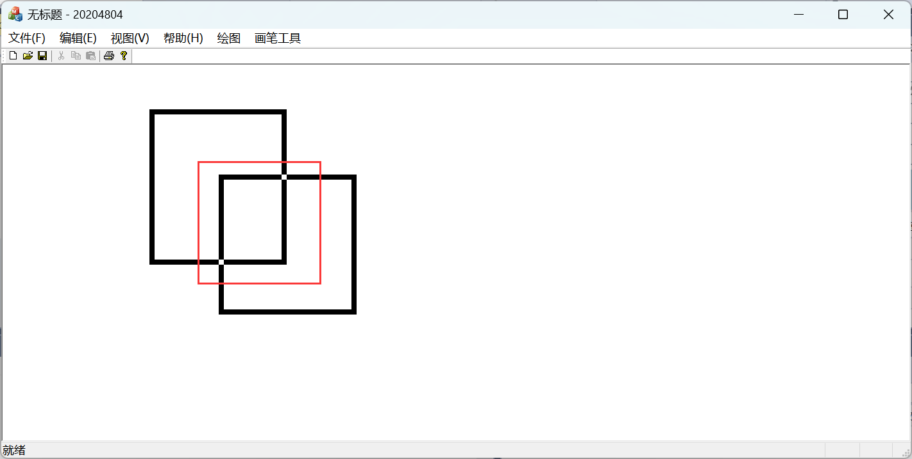

所以为解决此问题，在上面代码中增加一行： `dc.SelectStockObject(PS_NULL)`，将图案设置为透明即可。
同样地，最后要在 `OnLButtonUp`函数中重新绘画重合的部分：

```c++
case Shape::Rectangle: {
    dc.SelectStockObject(PS_NULL);
    CRect rectP2(BeginPoint, point);
    dc.Rectangle(rectP2);
    break;
}
```

至此矩形功能完成。

为 **正方形** 选项添加事件处理程序，当我们点击该选项时，将 `C20204804View`类源文件中的 `m_Shape`成员更改为 `Shape::Square`,代码如下：

```c++
//正方形
void CMy20204804View::OnDrawSquare()
{
	// TODO: 在此添加命令处理程序代码
	m_Shape = Shape::Square;
}
```

正方形的画法由矩形改编而来。它的终止点不再由鼠标的当前横纵坐标确定而只由鼠标当前的纵坐标决定，因为正方形的长和宽相等，故只需用起始点和终止点之间纵坐标的差距就可同时确定长和宽。代码如下：

```c++
case Shape::Square: {
    dc.SetROP2(R2_NOTXORPEN);//画笔颜色与屏幕像素值的异或再反色，达到画笔移动的效果
    dc.SelectStockObject(PS_NULL);
    int len1 = EndPoint.y - BeginPoint.y;
    if (EndPoint.x < BeginPoint.x) {//终点在起点左边
        EndPoint.x = BeginPoint.x - abs(len1);
    }
    else {//终点在起点右边
        EndPoint.x = BeginPoint.x + abs(len1);
    }
    CRect rectP(BeginPoint, EndPoint);
    dc.Rectangle(rectP);

    int len2 = point.y - BeginPoint.y;
    if (point.x < BeginPoint.x) {//终点在起点左边
        EndPoint.x = BeginPoint.x - abs(len2);
    }
    else {//终点在起点右边
        EndPoint.x = BeginPoint.x + abs(len2);
    }
    EndPoint.y = point.y;
    CRect rectP2(BeginPoint, EndPoint);
    dc.Rectangle(rectP2);
    EndPoint = point;
    break;
}
```

此处为了能向任意方向绘制正方形，增加了一个判断条件。抬起鼠标后，仍像之前那样重绘重合部分，这里不再赘述。

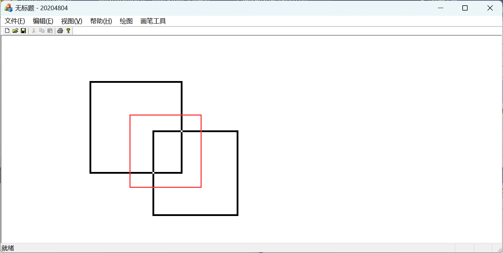

`OnLButtonUp`函数添加以下代码:

```c++
case Shape::Square: {
    dc.SelectStockObject(PS_NULL);

    int len2 = point.y - BeginPoint.y;
    if (point.x < BeginPoint.x) {//终点在起点左边
        EndPoint.x = BeginPoint.x - abs(len2);
    }
    else {//终点在起点右边
        EndPoint.x = BeginPoint.x + abs(len2);
    }
    EndPoint.y = point.y;
    CRect rectP2(BeginPoint, EndPoint);
    dc.Rectangle(rectP2);
    EndPoint = point;
    break;
}
```

至此正方形功能完成。

#### 多边形的编写实现

多边形包含三种图案：三角形、五边形、六边形（正方形和矩形已单独列出，故不在此范围内），每种图案有各自的画法，具体如下：

##### 三角形的编写实现

首先为 **三角形** 选项**添加事件处理程序**，当我们点击该选项时，将 `C20204804View`类源文件中的 `m_Shape`成员更改为 `Shape::Triangle`，过程不再赘述，代码如下：

```c++
//三角形
void CMy20204804View::OnDrawTriangle()
{
	// TODO: 在此添加命令处理程序代码
	m_Shape = Shape::Triangle;
}

```

绘画三角形的思路是，以鼠标左键按下的点为起点，鼠标的当前位置为终点。三角形的第一个顶点就是起点，第二个顶点定义如下：其横坐标为起点横坐标 **加上** 终点与起点的横坐标之差的绝对值，纵坐标为终点的纵坐标。第三个顶点定义如下：其横坐标为起点横坐标 **减去** 终点与起点的横坐标之差的绝对值，纵坐标为终点的纵坐标。因此由定义可以看出，本系统只能画出等腰的三角形。通过dc中的 `Polygon`函数将已定义的几个点顺次连接，就得到了三角形，代码如下：

```c++
case Shape::Triangle: {
    dc.SetROP2(R2_NOTXORPEN);//画笔颜色与屏幕像素值的异或再反色，达到画笔移动的效果
    dc.SelectStockObject(PS_NULL);
    int lenx = abs(EndPoint.x - BeginPoint.x);
    int leny = EndPoint.y - BeginPoint.y;
    CPoint pt[3] = { CPoint(BeginPoint.x,BeginPoint.y),
                     CPoint(BeginPoint.x + lenx,BeginPoint.y + leny),
                     CPoint(BeginPoint.x - lenx,BeginPoint.y + leny) };
    dc.Polygon(pt, 3);

    int lenx2 = abs(point.x - BeginPoint.x);
    int leny2 = point.y - BeginPoint.y;
    pt[0] = CPoint(BeginPoint.x, BeginPoint.y);
    pt[1] = CPoint(BeginPoint.x + lenx2, BeginPoint.y + leny2);
    pt[2] = CPoint(BeginPoint.x - lenx2, BeginPoint.y + leny2);
    dc.Polygon(pt, 3);
    EndPoint = point;
    break;
}
```

重合部分的处理不再赘述。下面直接上代码：

```c++
case Shape::Triangle: {
    dc.SelectStockObject(PS_NULL);
    int lenx2 = abs(point.x - BeginPoint.x);
    int leny2 = point.y - BeginPoint.y;
    CPoint pt[3] = { CPoint(BeginPoint.x,BeginPoint.y),
                     CPoint(BeginPoint.x + lenx2,BeginPoint.y + leny2),
                     CPoint(BeginPoint.x - lenx2,BeginPoint.y + leny2) };
    dc.Polygon(pt, 3);
    EndPoint = point;
    break;
}
```

至此三角形功能完成。

##### 五边形的编写实现

首先为 **五边形** 选项**添加事件处理程序**，当我们点击该选项时，将 `C20204804View`类源文件中的 `m_Shape`成员更改为 `Shape::Pentagon`，代码如下：

```c++
//五边形
void CMy20204804View::OnDrawPentagon()
{
	// TODO: 在此添加命令处理程序代码
	m_Shape = Shape::Pentagon;
}
```

五边形的第一个顶点仍以起点作为定义。然后将其余四个点划分为两组，第一组的两个点横坐标为起点的横坐标加上/减去终点横坐标与起点横坐标差的绝对值，纵坐标为终点的纵坐标。另一组的两个点为起点的横坐标加上/减去终点横坐标与起点横坐标差的绝对值的一定倍数，这个倍数模糊估计为1+1/1.6（是一个 *magic number*）。纵坐标为起点的纵坐标加上终点纵坐标与起点纵坐标差的绝对值的一定倍数，这个倍数模糊估计为1/2.6（是一个 *magic number*）。同样使用 `Polygon`将已定义的五个点顺次连接，就得到了五边形，代码较长，如下所示：

```c++
case Shape::Pentagon: {
    dc.SetROP2(R2_NOTXORPEN);//画笔颜色与屏幕像素值的异或再反色，达到画笔移动的效果
    dc.SelectStockObject(PS_NULL);
    int lenx = abs(EndPoint.x - BeginPoint.x);
    int leny = EndPoint.y - BeginPoint.y;
    int lenxx = lenx + lenx / 1.6;//大致比例
    int lenyy = leny / 2.6;//大致比例
    CPoint pt[5] = { CPoint(BeginPoint.x,BeginPoint.y),
                     CPoint(BeginPoint.x + lenxx,BeginPoint.y + lenyy),
                     CPoint(BeginPoint.x + lenx,BeginPoint.y + leny),
                     CPoint(BeginPoint.x - lenx,BeginPoint.y + leny),
                     CPoint(BeginPoint.x - lenxx,BeginPoint.y + lenyy) };
    dc.Polygon(pt, 5);

    int lenx2 = abs(point.x - BeginPoint.x);
    int leny2 = point.y - BeginPoint.y;
    int lenxx2 = lenx2 + lenx2 / 1.6;
    int lenyy2 = leny2 / 2.6;
    pt[0] = CPoint(BeginPoint.x, BeginPoint.y);
    pt[1] = CPoint(BeginPoint.x + lenxx2, BeginPoint.y + lenyy2);
    pt[2] = CPoint(BeginPoint.x + lenx2, BeginPoint.y + leny2);
    pt[3] = CPoint(BeginPoint.x - lenx2, BeginPoint.y + leny2);
    pt[4] = CPoint(BeginPoint.x - lenxx2, BeginPoint.y + lenyy2);
    dc.Polygon(pt, 5);
    EndPoint = point;
    break;
}
```

重合部分的处理不再赘述,代码如下：

```c++
case Shape::Pentagon: {
    dc.SelectStockObject(PS_NULL);
    int lenx2 = abs(point.x - BeginPoint.x);
    int leny2 = point.y - BeginPoint.y;
    int lenxx2 = lenx2 + lenx2 / 1.6;
    int lenyy2 = leny2 / 2.6;
    CPoint pt[5] = { CPoint(BeginPoint.x, BeginPoint.y),
                     CPoint(BeginPoint.x + lenxx2, BeginPoint.y + lenyy2),
                     CPoint(BeginPoint.x + lenx2, BeginPoint.y + leny2),
                     CPoint(BeginPoint.x - lenx2, BeginPoint.y + leny2),
                     CPoint(BeginPoint.x - lenxx2, BeginPoint.y + lenyy2) };
    dc.Polygon(pt, 5);
    EndPoint = point;
    break;
}
```

至此五边形功能完成。

##### 六边形的编写实现

至于**六边形**，首先为 **六边形** **选项添加事件处理程序**，当我们点击该选项时，将 `C20204804View`类源文件中的 `m_Shape`成员更改为 `Shape::Hexagon`。

```c++
//六边形
void CMy20204804View::OnDrawHexagon()
{
	// TODO: 在此添加命令处理程序代码
	m_Shape = Shape::Hexagon;
}
```

六边形的第一个顶点以起点作为定义，第二个顶点的横坐标与起点横坐标相同，纵坐标与终点纵坐标相同。然后将其余四个点划分为两组，第一组的两个点横坐标为起点的横坐标加上/减去终点横坐标与起点横坐标差的绝对值，纵坐标为起点的纵坐标 **加上** 终点纵坐标与起点纵坐标差的绝对值的一定倍数，这个倍数模糊估计为1/4。另一组的两个点横坐标则与第一组两个点相同，但纵坐标为另一倍数，这个倍数模糊估计为3/4。这样，再使用 `Polygon`将已定义的六个点顺次连接，就得到了六边形，代码较长，如下：

```c++
case Shape::Hexagon: {
    dc.SetROP2(R2_NOTXORPEN);//画笔颜色与屏幕像素值的异或再反色，达到画笔移动的效果
    dc.SelectStockObject(PS_NULL);
    int lenx = abs(EndPoint.x - BeginPoint.x);
    int leny = EndPoint.y - BeginPoint.y;
    int lenyy = leny / 4;//大致比例
    CPoint pt[6] = { CPoint(BeginPoint.x,BeginPoint.y),
                     CPoint(BeginPoint.x + lenx,BeginPoint.y + lenyy),
                     CPoint(BeginPoint.x + lenx,BeginPoint.y + leny - lenyy),
                     CPoint(BeginPoint.x,BeginPoint.y + leny),
                     CPoint(BeginPoint.x - lenx,BeginPoint.y + leny - lenyy),
                     CPoint(BeginPoint.x - lenx,BeginPoint.y + lenyy) };
    dc.Polygon(pt, 6);

    int lenx2 = abs(point.x - BeginPoint.x);
    int leny2 = point.y - BeginPoint.y;
    int lenyy2 = leny2 / 4;
    pt[0] = CPoint(BeginPoint.x, BeginPoint.y);
    pt[1] = CPoint(BeginPoint.x + lenx2, BeginPoint.y + lenyy2);
    pt[2] = CPoint(BeginPoint.x + lenx2, BeginPoint.y + leny2 - lenyy2);
    pt[3] = CPoint(BeginPoint.x, BeginPoint.y + leny2);
    pt[4] = CPoint(BeginPoint.x - lenx2, BeginPoint.y + leny2 - lenyy2);
    pt[5] = CPoint(BeginPoint.x - lenx2, BeginPoint.y + lenyy2);
    dc.Polygon(pt, 6);
    EndPoint = point;
    break;
}
```

重合部分的处理不再赘述,代码如下：

```c++
case Shape::Hexagon: {
    dc.SelectStockObject(PS_NULL);
    int lenx2 = abs(point.x - BeginPoint.x);
    int leny2 = point.y - BeginPoint.y;
    int lenyy2 = leny2 / 4;//大致比例
    CPoint pt[6] = { CPoint(BeginPoint.x,BeginPoint.y),
                     CPoint(BeginPoint.x + lenx2,BeginPoint.y + lenyy2),
                     CPoint(BeginPoint.x + lenx2,BeginPoint.y + leny2 - lenyy2),
                     CPoint(BeginPoint.x,BeginPoint.y + leny2),
                     CPoint(BeginPoint.x - lenx2,BeginPoint.y + leny2 - lenyy2),
                     CPoint(BeginPoint.x - lenx2,BeginPoint.y + lenyy2) };
    dc.Polygon(pt, 6);
    EndPoint = point;
    break;
}
```

至此六边形功能完成。

##### 圆形的编写实现

为 **圆形** 选项**添加事件处理程序**，当我们点击该选项时，将 `C20204804View`类源文件中的 `m_Shape`成员更改为 `Shape::Circle`

```c++
//圆
void CMy20204804View::OnDrawCircle()
{
	// TODO: 在此添加命令处理程序代码
	m_Shape = Shape::Circle;
}
```

圆形既可以看作是椭圆的特殊情况处理，也可参照正方形的情况处理。此处圆形的定义就是一个正方形的内接圆，所以在正方形的基础上，只需将绘画时用的 `Rectangle`函数更改为 `Ellipse`函数即可画出圆形。代码如下：

```c++
case Shape::Circle: {
    dc.SetROP2(R2_NOTXORPEN);//画笔颜色与屏幕像素值的异或再反色，达到画笔移动的效果
    dc.SelectStockObject(PS_NULL);
    int len1 = EndPoint.y - BeginPoint.y;
    if (EndPoint.x < BeginPoint.x) {//终点在起点左边
        EndPoint.x = BeginPoint.x - abs(len1);
    }
    else {//终点在起点右边
        EndPoint.x = BeginPoint.x + abs(len1);
    }
    CRect rectP(BeginPoint, EndPoint);
    dc.Ellipse(rectP);

    int len2 = point.y - BeginPoint.y;
    if (point.x < BeginPoint.x) {//终点在起点左边
        EndPoint.x = BeginPoint.x - abs(len2);
    }
    else {//终点在起点右边
        EndPoint.x = BeginPoint.x + abs(len2);
    }
    EndPoint.y = point.y;
    CRect rectP2(BeginPoint, EndPoint);
    dc.Ellipse(rectP2);
    EndPoint = point;
    break;
}
```

重合部分的处理不再赘述，代码如下：

```c++
case Shape::Circle: {
    dc.SelectStockObject(PS_NULL);

    int len2 = point.y - BeginPoint.y;
    if (point.x < BeginPoint.x) {//终点在起点左边
        EndPoint.x = BeginPoint.x - abs(len2);
    }
    else {//终点在起点右边
        EndPoint.x = BeginPoint.x + abs(len2);
    }
    EndPoint.y = point.y;
    CRect rectP2(BeginPoint, EndPoint);
    dc.Ellipse(rectP2);
    EndPoint = point;
    break;
}
```

至此圆形功能完成。

##### 椭圆形的编写实现

为 **椭圆** 选项添加事件处理程序，当我们点击该选项时，将 `CSimpleDrawView`类中的 `m_Shape`成员更改为 `Shape::Ellipse`。

```c++
//椭圆
void CMy20204804View::OnDrawEllipse()
{
	// TODO: 在此添加命令处理程序代码
	m_Shape = Shape::Ellipse;
}
```

椭圆可用dc自带的 `Ellipse`函数直接绘画。它的定义是一个矩形的内接椭圆，所以只需像画矩形那样先定义一个矩形，再将该矩形作为参数传入 `Ellipse`即可。代码如下：

```c++
case Shape::Ellipse: {
	dc.SetROP2(R2_NOTXORPEN);//画笔颜色与屏幕像素值的异或再反色，达到画笔移动的效果
	dc.SelectStockObject(PS_NULL);
	CRect rectP(BeginPoint, EndPoint);
	dc.Ellipse(rectP);
	CRect rectP2(BeginPoint, point);
	dc.Ellipse(rectP2);
	EndPoint = point;
	break;
}
```

重合部分的处理不再赘述，如下：

```c++
case Shape::Ellipse: {
    dc.SelectStockObject(PS_NULL);
    CRect rectP2(BeginPoint, point);
    dc.Ellipse(rectP2);
    break;
}
```

至此椭圆功能完成，同时所有基本图形功能也已完成，接下来就是辅助功能的实现！

### 第四步：辅助工具的编写

我们需要在`C20204804View`类源文件中修改以下代码，完成接下来辅助工具的实现

```c++
CMy20204804View::~CMy20204804View()
{
	if (m_Edit != nullptr) {
		delete m_Edit;
		m_Edit = nullptr;
	}
}
```

在`C20204804View`类源文件中创以下函数，并完成代码的编写

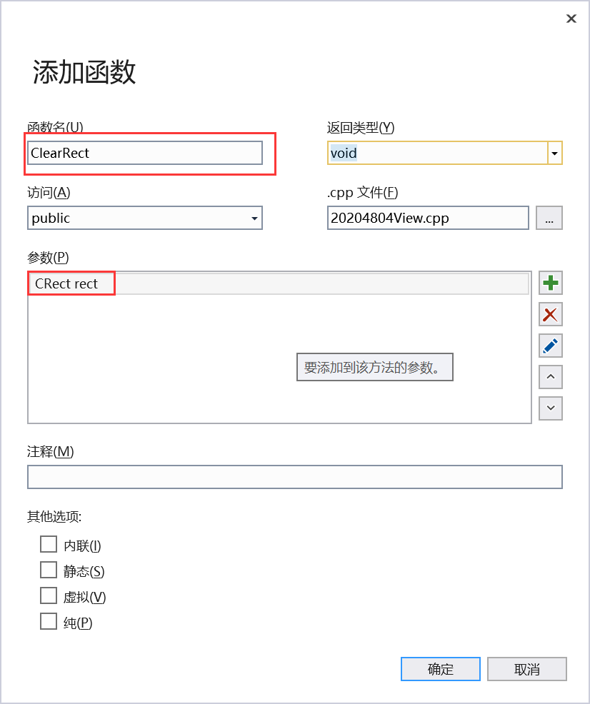

```c++
void CMy20204804View::ClearRect(CRect rect)
{
	// TODO: 在此处添加实现代码.
	CClientDC dc(this);
	CPen choosePen, *oldPen;
	choosePen.CreatePen(PS_DASH, 1, RGB(255, 255, 255));
	oldPen = dc.SelectObject(&choosePen);
	dc.SetROP2(R2_COPYPEN);
	dc.SelectStockObject(PS_NULL);
	dc.Rectangle(rect);
}
```

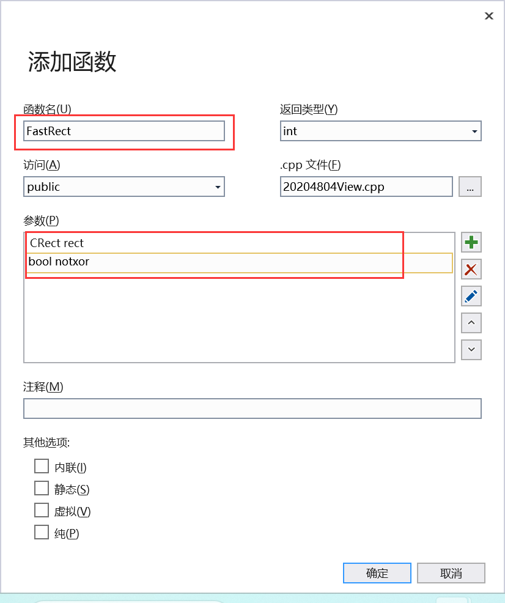

```c++
void CMy20204804View::FastRect(CRect rect, bool notxor)
{
	// TODO: 在此处添加实现代码.
	CClientDC dc(this);
	CPen choosePen, *oldPen;
	choosePen.CreatePen(PS_DASH, 1, RGB(0, 0, 0));
	oldPen = dc.SelectObject(&choosePen);
	if (notxor) {
		dc.SetROP2(R2_NOTXORPEN);//画笔颜色与屏幕像素值的异或再反色，达到画笔移动的效果
	}
	dc.SelectStockObject(PS_NULL);
	dc.Rectangle(rect);
}
```

#### 文本框的编写实现

为 **文本框** 选项**添加事件处理程序**，当我们点击该选项时，将 `C20204804View`类源文件中的 `m_Shape`成员更改为 `Shape::Text`。

```c++
//文本框
void CMy20204804View::OnText()
{
	// TODO: 在此添加命令处理程序代码
	m_Shape = Shape::Text;
}
```

我们调用项目中自带的 `CEdit`类完成文本框的绘制。当鼠标左键按下时用 `Text_Pos`记录文本框位置。鼠标移动时，创建一个 `CEdit`指针 `CEdit* m_edit = new CEdit()`，通过 `Create(WS_CHILD | WS_VISIBLE | WS_BORDER, CRect(BeginPoint, point), this, Textid)`函数创建一个文本框，四个参数分别为文本框风格，文本框大小（从鼠标左键按下的起始点到鼠标当前坐标点），当前工作窗口，文本框编号（任意数字，初始化为100）。再使用 `ShowWindow(SW_SHOW)`将其显示在屏幕上即可。属于 `C20204804View`类的 `m_Edit`时刻指向当前文本框，故每次更新 `m_Edit`时都应先将其原本指向的对象释放，以免内存泄漏，在`OnMouseMove`函数中添加如下代码：

```c++
case Shape::Text: {
    if (nullptr != m_Edit) {
        delete m_Edit;
    }
    CEdit* m_edit = new CEdit();
    m_edit->Create(WS_CHILD | WS_VISIBLE | WS_BORDER, CRect(BeginPoint, point), this, Textid);
    m_Edit = m_edit;
    m_edit->ShowWindow(SW_SHOW);

    break;
}
```

屏幕上始终只会显示一个文本框，故不需要做额外处理。鼠标抬起后，再次重绘一遍当前文本框，就可将文本框长时间显示在屏幕上，在`OnLButtonUp`函数中添加如下代码：

```c++
case Shape::Text: {
    CEdit* m_edit = new CEdit();
    m_edit->Create(WS_CHILD | WS_VISIBLE | WS_BORDER, CRect(BeginPoint, point), this, Textid);
    m_edit->ShowWindow(SW_SHOW);
    if (nullptr != m_Edit) {
        delete m_Edit;
    }
    m_Edit = m_edit;
    break;
}
```

接下来我们便可在文本框中输入一些文字，只要按下回车，就能将这些文字显示在屏幕上。为了实现该功能，我们必须借助**类向导**添加一个虚函数 `PreTranslateMessage(MSG* pMsg)`，它负责响应我们的键盘消息。所以，我们将在该函数中添加代码，当我们按下回车键时即 `(pMsg->message == WM_KEYDOWN && pMsg->wParam == VK_RETURN)`，如果我们正在使用 `Shape::Text`模式，就会用 `GetWindowTextW`函数提取出文本框中的文字，然后将文本框释放，再用 `TextOutW`仅将文字显示在屏幕上。


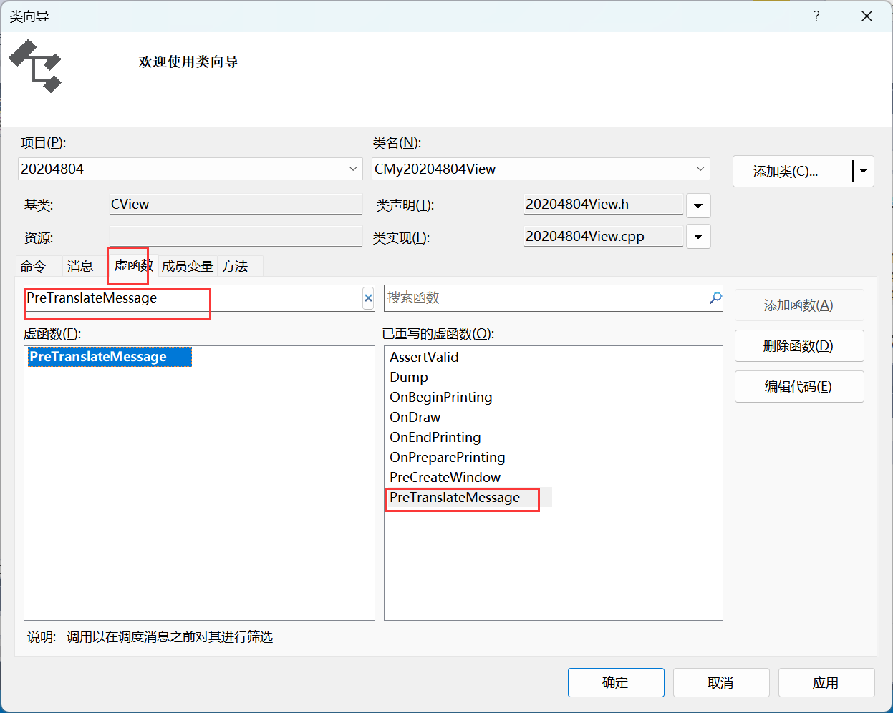

注意当屏幕上存在文本框时如果我们切换到了其他绘画工具，根据习惯同样应该释放文本框，所以这时要进行和按下回车键一样的操作。具体在`PreTranslateMessage`函数中添加代码如下：

```c++
if (m_Shape != Shape::Choose && Chosen) {//从选择切换到了其他模式
    CRect area(Chooselt, Choosebr);
    ClearRect(area);
    Chosen = false;
}
//按下回车或从文本切换到了其他模式
if ((m_Shape != Shape::Text || (pMsg->message == WM_KEYDOWN && pMsg->wParam == VK_RETURN && m_Shape == Shape::Text)) && m_Edit != nullptr) {
	CString pStr;
	m_Edit->GetWindowTextW(pStr);
	delete m_Edit;
	m_Edit = nullptr;
	CClientDC dc(this);
	dc.TextOutW(Text_Pos.x, Text_Pos.y, pStr);
	return TRUE;
}
```

至此文本框功能实现。

#### 填充的编写实现

为 **填充** 选项添加事件处理程序，当我们点击选项时，将 `C20204804View`类源文件中的 `m_Shape`成员更改为 `Shape::Fill`。

```c++
void CMy20204804View::OnFillColor()
{
	// TODO: 在此添加命令处理程序代码
	m_Shape = Shape::Fill;
}
```

填充只需在鼠标按下的那一刻执行即可，所以相关代码将在 `OnLButtonDown`中添加。当我们按下鼠标左键，如果是在 `Shape::Fill`模式，就使用我们预先设定的填充颜色 `Brush_Color`，然后利用 `ExtFloodFill(BeginPoint.x, BeginPoint.y, RGB(255,255,255), FLOODFILLSURFACE)`函数进行填充。其中前两个参数代表我们鼠标按下的点。 `FLOODFILLSURFACE`代表从按下的点开始，填充所有颜色为前一个参数的像素，直到碰到不是该颜色的像素为止。这样填充功能就完成了，`OnLButtonDown`函数添加代码如下：

```c++
if (m_Shape == Shape::Fill) {
    CClientDC Dc(this);
    CBrush cBr(Brush_Color);
    Dc.SelectObject(&cBr);
    Dc.ExtFloodFill(BeginPoint.x, BeginPoint.y, RGB(255, 255, 255), FLOODFILLSURFACE);
}
```

至此填充功能实现。

#### 铅笔的编写实现

为 **填充** 选项添加事件处理程序，当我们点击选项时，将 `C20204804View`类源文件中的 `m_Shape`成员更改为 `Shape::Shape::Pencil`。

```c++
//铅笔
void CSimpleDrawView::OnSetPencil()
{
	// TODO: 在此添加命令处理程序代码
	m_Shape = Shape::Pencil;
}
```

铅笔只需要让窗口实时跟踪我们鼠标的轨迹然后用某种颜色画出来即可。这和画直线十分相似，用 `MoveTo`和 `LineTo`即可实现，与直线不同的是，我们的起始点始终为鼠标上一时刻的坐标，这样就可实时跟踪轨迹。`OnMouseMove`函数添加代码如下：

```c++
case Shape::Pencil: {
    BeginPoint = EndPoint;//终点做新起点
    EndPoint = point;
    dc.MoveTo(BeginPoint);
    dc.LineTo(EndPoint);
    break;
}
```

至此铅笔功能实现。

#### 橡皮擦的编写实现

为 **填充** 选项添加事件处理程序，当我们点击选项时，将 `C20204804View`类源文件中的 `m_Shape`成员更改为 `Shape::Shape::Eraser`。

```c++
//橡皮擦
void CMy20204804View::OnSetEraser()
{
	// TODO: 在此添加命令处理程序代码
	m_Shape = Shape::Eraser;
}
```

橡皮的操作与铅笔完全相同，只不过画笔颜色不一样，使用橡皮时强制将画笔颜色设置为背景色，这样鼠标经过之处均变为背景色，相当于擦除了原本的图案。橡皮的粗细用画笔的粗细代表。代码如下：

```c++
case Shape::Eraser: {
    COLORREF pColor = dc.GetBkColor();
    CPen newPen(PS_SOLID, Pen_Size, pColor);
    dc.SelectObject(&newPen);

    BeginPoint = EndPoint;//终点做新起点
    EndPoint = point;
    dc.MoveTo(BeginPoint);
    dc.LineTo(EndPoint);

    break;
}
```

至此橡皮擦功能实现。

#### 选择功能的编写实现

择功能的实现较为复杂。首先为 **选择区域** 选项添加事件处理程序，当我们点击选项时，将 `C20204804View`类源文件中的 `m_Shape`成员更改为 `Shape::Choose`。以下功能均在该模式下执行。

```c++
//选择
void CMy20204804View::OnChoose()
{
	// TODO: 在此添加命令处理程序代码
	m_Shape = Shape::Choose;
}
```

##### 选择某一区域

选择功能对于用户来说就是画出一个矩形框住一个范围，所以实现方法与画矩形相同。为避免与矩形混淆，我们用虚线画矩形，而且强制画笔粗细为最细，颜色为黑色。`OnMouseMove`函数添加代码如下：

```c++
case Shape::Choose: {
    if (!Chosen) {
        CRect rectP(BeginPoint, EndPoint);
        FastRect(rectP, true);
        CRect rectP2(BeginPoint, point);
        FastRect(rectP2, true);
        EndPoint = point;
    }
}
```

此处用到了快速描绘选框矩形的一个函数 `FastRect`，详见源代码。 当我们抬起鼠标左键的一刻即代表选择完毕，此时置一个 `bool`变量 `Chosen`（在 `C20204804View`类头文件中定义）为 `True`。这意味着我们已经选择了一个区域，可以进行接下来的几个操作。此时如果再次点击区域以外的位置，将会重新选择区域。`LButtonDown`函数添加代码如下：

```c++
if (Chosen) {
    CRect area(Chooselt, Choosebr);
    if (!area.PtInRect(point))
    {
        /*要进行的操作*/
        Chosen = false;
        ClearRect(area);

    }
}
```

至此选择框功能实现。

##### 拖动某一区域

为了实现拖动功能，选择完区域的同时，我们需要对当前画面做一些处理。由于接下来拖动该区域后，这片区域将变为空白，为实现这个效果，我们需要用到其他两个dc（须事先在`C20204804View`类头文件中定义）: `HDC bc_hdc`保存当前图像。然后将该选框内图像填为空白，再用 `HDC ac_hdc`保存此时图像。这样拖动选区时，先重绘 `ac_hdc`中的图像到工作区，再重绘 `bc_hdc`中选区的那一块图像到工作区，就实现了拖动功能。当然，这时还应记录下选区的坐标（左上角和右下角）以及初始化有关拖动的工作变量以便后续处理。`OnLButtonUp`函数添加代码如下：

```c++
case Shape::Choose: {
    if (!Chosen) {
        CRect rectP2(BeginPoint, point);
        ClearRect(rectP2);
        CRect rect;
        GetClientRect(&rect);
        HBITMAP hbitmap = CreateCompatibleBitmap(dc, rect.right - rect.left, rect.bottom - rect.top);//创建兼容位图
        bc_hdc = CreateCompatibleDC(dc);      //创建兼容DC，以便将图像保存为不同的格式
        SelectObject(bc_hdc, hbitmap);//将位图选入DC，并保存返回值 
        BitBlt(bc_hdc, 0, 0, rect.right - rect.left, rect.bottom - rect.top, dc, 0, 0, SRCCOPY);//将屏幕DC图像复制到内存DC

        CBrush cBr(RGB(255, 255, 255));
        dc.FillRect(rectP2, &cBr);

        hbitmap = CreateCompatibleBitmap(dc, rect.right - rect.left, rect.bottom - rect.top);//创建兼容位图
        ac_hdc = CreateCompatibleDC(dc);
        SelectObject(ac_hdc, hbitmap);
        BitBlt(ac_hdc, 0, 0, rect.right - rect.left, rect.bottom - rect.top, dc, 0, 0, SRCCOPY);
        StretchBlt(dc, BeginPoint.x, BeginPoint.y, rectP2.Width(), rectP2.Height(),
            bc_hdc, BeginPoint.x, BeginPoint.y, rectP2.Width(), rectP2.Height(), SRCCOPY);
        FastRect(rectP2, false);
        EndPoint = point;
        Chosen = true;
        Chooselt = BeginPoint;
        Choosebr = point;
        Startlt = Chooselt;
        Startbr = Choosebr;
        Tempclt = Chooselt;
        Tempcbr = Choosebr;
    }
    else {
        Chooselt = Tempclt;
        Choosebr = Tempcbr;
        CRect rectP2(Chooselt, Choosebr);
        FastRect(rectP2, false);
    }

    break;
}
```

其中 `CPoint Chooselt, Choosebr, Tempclt, Tempcbr, Startlt, Startbr`需要事先定义在 `CSimpleDrawView`类中，它们记录选框的左上角坐标（lt）和右下角坐标（br）。
上面是在我们首次选择某区域后抬起左键执行的操作。此后再次点击鼠标左键，如果落点在区域内，我们就可以按住鼠标拖动该区域（否则就是重新选区）。 `Chooselt`和 `Choosebr`为选框静止的位置， `Tempclt`和 `Tempcbr`为选框移动过程中实时的位置。松开鼠标左键时，更新选框静止位置。`OnMouseMove`函数修改代码如下：

```c++
case Shape::Choose: {
    if (!Chosen) {
        CRect rectP(BeginPoint, EndPoint);
        FastRect(rectP,true);
        CRect rectP2(BeginPoint, point);
        FastRect(rectP2,true);
        EndPoint = point;
    }
    else {
        CRect area(Tempclt, Tempcbr);
        ClearRect(area);
        CRect rect;
        GetClientRect(&rect);
        StretchBlt(dc, 0, 0, rect.Width(), rect.Height(),
            ac_hdc, 0, 0, rect.Width(), rect.Height(), SRCCOPY);
        int lenx = point.x - BeginPoint.x;
        int leny = point.y - BeginPoint.y;
        Tempclt = CPoint(Chooselt.x + lenx, Chooselt.y + leny);
        Tempcbr = CPoint(Choosebr.x + lenx, Choosebr.y + leny);
        CRect newarea(Tempclt, Tempcbr);
        StretchBlt(dc, Tempclt.x, Tempclt.y, newarea.Width(), newarea.Height(),
            bc_hdc, Startlt.x, Startlt.y, Startbr.x - Startlt.x, Startbr.y - Startlt.y, SRCCOPY);
        FastRect(newarea,true);
    }

    break;
}
```

至此拖动功能实现。

##### 缩放某一区域

缩放功能是拖动功能的特殊情况，我们可以改变选区的大小。在拖动功能中，选区的左上角和右下角会随着鼠标移动。而在缩放功能中，固定左上角不动，只有右下角移动，就实现了选区大小的更改。此外 `StretchBlt`函数也将自动将原选区的图像按比例画到新选区中，就实现了缩放功能。在操作上，本系统用按住鼠标右键移动的方式进行缩放。故还应对 `OnRButtonDown`和 `OnRButtonUp`函数添加一些必要代码:

```c++
void C20204804View::OnRButtonDown(UINT nFlags, CPoint point)
{
	// TODO: 在此添加消息处理程序代码和/或调用默认值
	if (Chosen) {
		BeginPoint = EndPoint = point;
	}
	CView::OnRButtonDown(nFlags, point);
}
```

```c++
void C20204804View::OnRButtonUp(UINT nFlags, CPoint point)
{
	// TODO: 在此添加消息处理程序代码和/或调用默认值
	CClientDC dc(this);
	if (Chosen) {
		Chooselt = Tempclt;
		Choosebr = Tempcbr;
		CRect rectP2(Chooselt, Choosebr);
		FastRect(rectP2,false);
	}
		
	CView::OnRButtonUp(nFlags, point);
}
```

在`OnMouseMove`函数中添加如下代码：

```c++
if (nFlags & MK_RBUTTON) {
	CClientDC dc(this);
	if (m_Shape == Shape::Choose && Chosen) {
		CRect area(Tempclt, Tempcbr);
		ClearRect(area);
		CRect rect;
		GetClientRect(&rect);
		StretchBlt(dc, 0, 0, rect.Width(), rect.Height(),
			ac_hdc, 0, 0, rect.Width(), rect.Height(), SRCCOPY);
		int lenx = point.x - BeginPoint.x;
		int leny = point.y - BeginPoint.y;
		Tempcbr = CPoint(Choosebr.x + lenx, Choosebr.y + leny);
		CRect newarea(Tempclt, Tempcbr);
		StretchBlt(dc, Tempclt.x, Tempclt.y, newarea.Width(), newarea.Height(),
		bc_hdc, Startlt.x, Startlt.y, Startbr.x - Startlt.x, Startbr.y - Startlt.y, SRCCOPY);
		FastRect(newarea);
	}
}
```

至此缩放功能实现。

##### 删除某一区域

本系统采用按下退格键删除区域的方式。故该部分在 `PreTranslateMessage`中执行。只需将 `ac_hdc`中保存的图像重绘到工作区并取消选框即可，添加代码如下：

```c++
if (pMsg->message == WM_KEYDOWN && pMsg->wParam == VK_BACK) {//按下退格
    if (Chosen) {
        CClientDC dc(this);
        CRect rect;
        GetClientRect(&rect);
        StretchBlt(dc, 0, 0, rect.Width(), rect.Height(),
                   ac_hdc, 0, 0, rect.Width(), rect.Height(), SRCCOPY);
        Chosen = false;
        return TRUE;
    }
}
```

至此删除某一区域功能实现。

#### 撤销的编写实现

现在首先我们需要创建CTempSave类，该类提供了撤回具体逻辑，步骤如下图：


为类命名，命名规范就不多说了,然后点击确定


`CTempSave`类创建好后，编辑器会自动帮我们建好头文件和源文件，给`CTempSave`类头文件添加如下代码：

```c++
#pragma once
#include <list>
#define MAX_SAVE 10
using namespace std;
int TempSave(CWnd* pWnd, list<HBITMAP>& SaveSeries, int savenum);
int OpenTemp(CWnd* pWnd, list<HBITMAP>& SaveSeries);
int Redraw(CWnd* pWnd, HBITMAP savemap, int x, int y);
class CTempSave
{
};
```

接下来再给`CTempSave`类源文件添加如下代码：

```c++
#include "pch.h"
#include "CTempSave.h"
int TempSave(CWnd* pWnd, list<HBITMAP>& SaveSeries, int savenum) {
	CClientDC dc(pWnd);
	CRect rect;
	GetClientRect(pWnd->GetSafeHwnd(), &rect);//获取画布大小
	HBITMAP hbitmap = CreateCompatibleBitmap(dc, rect.right - rect.left, rect.bottom - rect.top);//创建兼容位图
	HDC hdc = CreateCompatibleDC(dc);      //创建兼容DC，以便将图像保存为不同的格式
	HBITMAP hOldMap = (HBITMAP)SelectObject(hdc, hbitmap);//将位图选入DC，并保存返回值 
	BitBlt(hdc, 0, 0, rect.right - rect.left, rect.bottom - rect.top, dc, 0, 0, SRCCOPY);//将屏幕DC图像复制到内存DC
	if (savenum > MAX_SAVE) {
		SaveSeries.pop_front();
	}
	SaveSeries.push_back(hbitmap);
	SelectObject(hdc, hOldMap);
	return 1;
}
int OpenTemp(CWnd* pWnd, list<HBITMAP>& SaveSeries) {
	Redraw(pWnd, SaveSeries.back(), 0, 0);
	SaveSeries.pop_back();
	return 1;
}
int Redraw(CWnd* pWnd, HBITMAP savemap, int x, int y) {
	CBitmap loadImageBitmap;
	loadImageBitmap.Attach(savemap);
	BITMAP bitmap;
	loadImageBitmap.GetBitmap(&bitmap);

	CBrush newBrush, *oldBrush;
	CPen newPen, *oldPen;
	newBrush.CreatePatternBrush(&loadImageBitmap);
	newPen.CreatePen(PS_NULL, 1, RGB(0, 0, 0));
	CClientDC dc(pWnd);
	oldBrush = (CBrush*)dc.SelectObject(&newBrush);
	oldPen = dc.SelectObject(&newPen);
	dc.Rectangle(x, y, x + bitmap.bmWidth, y + bitmap.bmHeight);
	dc.SelectObject(oldBrush);
	dc.SelectObject(oldPen);
	return 1;
}
```

至此我们完成了撤销逻辑代码的编写，接下来就要为 **撤销** 选项**添加事件处理程序**


由于我们需要在`C20204804View`类源文件使用CTempSave类提供的函数，所以要在`C20204804View`类源文件顶部中引入`CTempSave`类

```c++
#include "CTempSave.h"
```

下一步在`OnEditUndo`撤回函数中添加如下代码：

```c++
//撤回
void CMy20204804View::OnEditUndo()
{
	// TODO: 在此添加命令处理程序代码
	if (!SaveSeries.empty()) {
		OpenTemp(this, SaveSeries);
		savenum--;
	}
	else {
		MessageBox((CString)"已经是第一步");
	}
}
```

在 `C20204804View`类头文件中定义了一个列表 `list<HBITMAP> SaveSeries`暂存所有的屏幕图像（**前些步骤由于某些原因注释掉了，需要解除注释**，并在`C20204804View`类头文件中的顶部引入命名空间）代码如下：

```c++
#include <list>
#define MAX_SAVE 10
using namespace std;
```

当按下撤销快捷键时就调用该处理程序，取 `SaveSeries`中最后一个图像绘制到工作区，并将其弹出即可。这里规定最大撤回步数为 *10*。在 `C20204804View.cpp`中包含其头文件即可调用其中函数。此外，增加了一个限制条件，**在"选择区域"模式下不会暂存图像** ，至此撤回功能实现。

#### 保存与打开文件

为保存文件，额外添加一个 `CSaveHelper`类，具体保存的方式与实现选择功能时的类似，添加类的步骤和之前创建`CTempSave`类步骤是一样的，这里不再赘述，为`CSaveHelper`类头文件添加如下代码:

```c++
#pragma once
class CSaveHelper
{
public:
	CSaveHelper();
	~CSaveHelper();

public:
	int Save(CWnd* pWnd, CString filePath);
};
```

为`CSaveHelper`类源文件添加如下代码:

```c++
#include "pch.h"
#include "CSaveHelper.h"
CSaveHelper::CSaveHelper()
{
}
CSaveHelper::~CSaveHelper()
{
}
int CSaveHelper::Save(CWnd* pWnd, CString filePath)
{
	CClientDC dc(pWnd);
	CRect rect;
	GetClientRect(pWnd->GetSafeHwnd(), &rect);//获取画布大小
	HBITMAP hbitmap = CreateCompatibleBitmap(dc, rect.right - rect.left, rect.bottom - rect.top);//创建兼容位图
	HDC hdc = CreateCompatibleDC(dc);      //创建兼容DC，以便将图像保存为不同的格式
	HBITMAP hOldMap = (HBITMAP)SelectObject(hdc, hbitmap);//将位图选入DC，并保存返回值 
	BitBlt(hdc, 0, 0, rect.right - rect.left, rect.bottom - rect.top, dc, 0, 0, SRCCOPY);//将屏幕DC图像复制到内存DC
	CImage image;
	image.Attach(hbitmap);                //将位图转化为一般图像

	HRESULT hResult = image.Save(filePath);     //保存图像
	if (FAILED(hResult))
	{
		return -1;
	}
	else
	{
		return 1;
	}
	image.Detach();
	SelectObject(hdc, hOldMap);
	return 0;
}
```

使用项目自带的保存函数即可将图像保存。该系统仅支持保存为 `bmp`格式。打开文件时从文件中加载图像，再将其绘制到工作区即可，仅支持打开 `bmp`文件。打开文件时设置 `m_Shape`成员为 `Shape::LImage`，为 **保存** 选项**添加事件处理程序**


避免绘制出多余图案。源代码如下

```c++
//文件保存
void CMy20204804View::OnFileSave()
{
	// TODO: 在此添加命令处理程序代码
	CString filename, filter, strSave;
	strSave = "bmp";
	filename = "test.bmp";
	filter = "bmp图片(*.bmp)|*.bmp||";
	CFileDialog dlg(FALSE, strSave, filename, 6UL, filter);
	CSaveHelper obj;
	if (dlg.DoModal() == IDOK)
	{
		if (obj.Save(this, dlg.GetPathName()) > 0)
		{
			MessageBox((CString)"图片已保存");
		}
	}
}
```

至此**保存文件**功能实现，接下来为**打开文件**功能**添加事件处理程序**，这里不再赘述，代码如下：

```c++
//打开文件
void CMy20204804View::OnFileOpen()
{
	// TODO: 在此添加命令处理程序代码
	m_Shape = Shape::LImage;
	CString filter, strPath;
	filter = "bmp图片(*.bmp)|*.bmp||";
	CFileDialog dlg(TRUE, NULL, NULL, OFN_HIDEREADONLY, filter);
	if (dlg.DoModal() == IDOK) {
		strPath = dlg.GetPathName();
	}
	else {
		return;
	}

	HBITMAP hBitmap = (HBITMAP)::LoadImage(NULL, strPath, IMAGE_BITMAP, 0, 0, LR_LOADFROMFILE);
	CBitmap loadImageBitmap;
	loadImageBitmap.Attach(hBitmap);

	BITMAP bitmap;
	loadImageBitmap.GetBitmap(&bitmap);

	CBrush newBrush, *oldBrush;
	CPen newPen, *oldPen;
	newBrush.CreatePatternBrush(&loadImageBitmap);
	newPen.CreatePen(PS_NULL, 1, RGB(0, 0, 0));
	CClientDC dc(this);
	oldBrush = (CBrush*)dc.SelectObject(&newBrush);
	oldPen = dc.SelectObject(&newPen);
	dc.Rectangle(0, 0, bitmap.bmWidth, bitmap.bmHeight);
	dc.SelectObject(oldBrush);
	dc.SelectObject(oldPen);
}
```

至此打开文件功能实现，并且该程序所有功能都已实现，拜拜，再见，祝您生活愉快！

### 待完善的地方

- 鼠标在移动过程中图形会不停闪烁（需要使用双缓冲技术解决）。
- 文本框会遮盖住原本的图形，且其中文字不能修改大小。
- 清除选框时会使原本处在选框边界的线条消失。
- 尚未添加画正多边形的功能。
- 填充功能目前只支持填充白色背景。
- 代码存在较多冗余。
